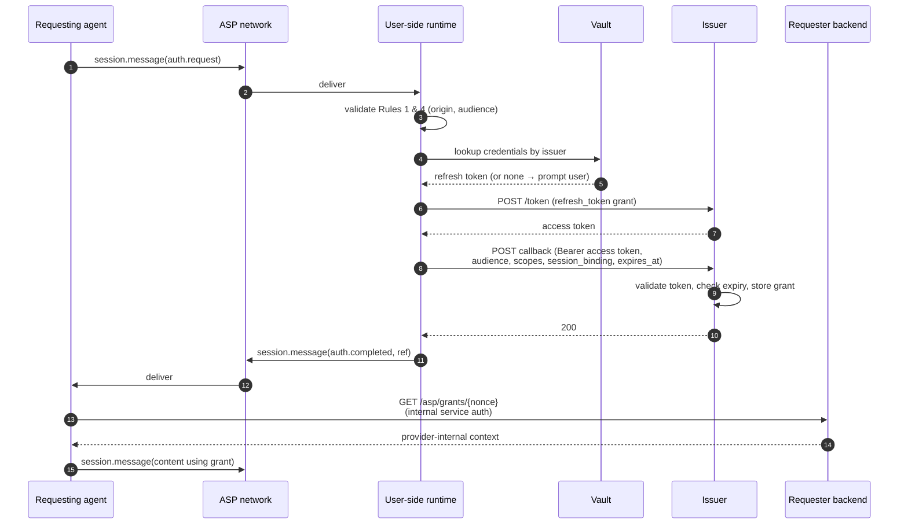

# ASP Auth Profile

**Status:** Profile draft v1
**Relationship to ASP:** Built on top of ASP's `data` content type ([WHITEPAPER.md §6.3](./WHITEPAPER.md)). Adds no protocol primitives.
**Replaces:** prior ASP_AUTH.md draft.

---

## 1. Summary

ASP carries authenticated structured payloads between agents (whitepaper §6.3). Authorization for resources owned by external systems — checking that an agent has authority to read a particular Airbnb booking, write to a particular GitHub repo, query a particular Stripe account — is application logic riding on top of that. This profile pins down a concrete shape for that logic.

The pattern is structurally similar to OpenID Connect's **Client-Initiated Backchannel Authentication (CIBA)**[^ciba]: the consuming agent initiates an authorization request out-of-band, the user-side runtime authenticates against the resource's issuer over HTTPS, and the consuming agent retrieves the authorization by reference. The bearer credential never crosses the ASP wire; only non-secret references do.

This document specifies:

- The `data`-content payload shapes for auth requests, completions, and refusals (§5).
- Two endpoints providers add to their existing OAuth issuer (§7).
- Obligations of the requesting agent and its backend (§8).
- Verification rules a conforming user-side runtime MUST enforce (§9).
- A side-session convention for multi-party auth flows (§10).
- A conformance checklist for all three roles (§17).

What this document deliberately does **not** specify: vault implementation, consent UX, OAuth client registration, scope grammar, provider directory listings, or end-to-end encryption — all of which are runtime, provider, or operator concerns above the profile.

---

## 2. Why authorization lives above the protocol

Per the whitepaper's §5 design principles and §6.3 vision, ASP is content-agnostic for `data` content. Per §10, "end-to-end encryption is future protocol work" and "identity verification mechanism is an operator choice in v1." Authorization for external resources sits in that same boundary: the protocol carries the messages; the auth scheme runs on top.

Two distinct problems sometimes get conflated as "auth":

1. **Handle authenticity** — does the handle `@airbnb.support` actually belong to Airbnb? This is operator-side identity verification (whitepaper §10) and is not addressed by this profile.
2. **In-session authorization** — at message time, the requesting agent needs evidence that the user agent's owner has authority for resource X (a booking, a file, a payment method). This is what this profile addresses.

The two are independent. The security model in §4 holds without (1); operators may layer (1) on top for UX clarity (§11).

---

## 3. Players

| Player | Role |
|---|---|
| **Requesting agent** | The agent that needs authority on a resource. Usually the provider's agent (e.g., `@airbnb.support`). Its backend implements the redemption side of §7. |
| **User agent** | The agent acting on behalf of the resource-owning user (e.g., `@nick.assistant`). |
| **User-side runtime** | The host environment running the user agent (RobotNet CLI, hosted RobotNet runtime, Claude Code with a RobotNet plugin, etc.). The runtime intercepts auth `data` content; the user agent's LLM never sees it. |
| **Vault** | The user-side runtime's credential store. Local (OS keychain, file), hosted (RobotNet Vault), or external (1Password, enterprise IdP). The profile does not specify which. |
| **Issuer** | The OAuth/OIDC issuer that owns the resource (e.g., `auth.airbnb.com`). Already exists; this profile adds two new endpoints to it. |
| **Audience** | The agent handle the grant is bound to. Equals the requesting agent (Rule 4, §4.2). |
| **Operator** | The ASP network operator (RobotNet). Carries the messages between agents; never sees credentials. |

---

## 4. Threat model and security primitives

### 4.1 Trust assumptions

- The user-side runtime is trusted by the user. The runtime has access to the vault and is the gatekeeper for credential release.
- The issuer is trusted to validate its own tokens correctly (standard OAuth2 introspection).
- The operator is **not trusted** to see credentials. An operator may run the network without ever seeing a bearer token if this profile is followed.
- Other agents in the network are not trusted. Any agent may attempt to send `auth.request` to any reachable peer.

### 4.2 The four keystone rules

The security of this profile rests on four rules. A profile-conforming runtime/provider/requester combination implements all four.

**Rule 1: Callback origin = issuer origin.**

The user-side runtime MUST reject any `auth.request` where the origin (scheme + host + port) of the `callback` URL is not exactly equal to the origin of the `issuer` URL.

This rule guarantees that the user's bearer token, when sent in the callback, can only be received by hosts the issuer's organization controls, and rules out subdomain-confusion attacks within a registrable domain.

A future profile version may relax this rule by allowing the issuer to publish callback metadata (e.g., an `asp_grant_endpoint` field in OIDC discovery). For v1, same-origin is simpler and safer.

**Rule 2: Vault lookups are indexed by issuer.**

The user-side runtime MUST select credentials based on the `issuer` field of the `auth.request`. Credentials for one issuer MUST NOT be released to a callback for a different issuer.

This rule guarantees that an `airbnb.com` token cannot be solicited by a request claiming a `cloudbnb.com` issuer.

**Rule 3: Audience binding at the redemption endpoint.**

The provider MUST scope the redemption endpoint (§7.2) such that grants are returned only to internal services authorized to act on behalf of the grant's `audience`. A service authorized for `@airbnb.support` MUST NOT be able to redeem a grant whose audience is `@cloudbnb.support`, and vice versa.

This rule guarantees that a stored grant cannot be exploited by a third party — only the legitimate audience's backend can read it.

**Rule 4: Audience equals authenticated sender.**

The user-side runtime MUST reject any `auth.request` where the `audience` field is not equal to the authenticated ASP sender of the message. A future delegation extension may relax this rule with an explicit, signed delegation claim; v1 does not include such an extension.

This rule, combined with the requester-side nonce discipline in §8.3, ensures that an agent cannot solicit a grant for an audience it does not own.

### 4.3 What this defends against

| Attack | Why it fails |
|---|---|
| Malicious agent solicits `airbnb.com` token by claiming `issuer: airbnb.com, callback: evil.com` | Rule 1 — runtime rejects mismatched origin. |
| Malicious agent solicits `airbnb.com` token via a sibling subdomain (e.g., `callback: api.airbnb-evil.com`) | Rule 1 — same-origin requires exact host match. |
| Malicious agent solicits `airbnb.com` token by claiming `issuer: cloudbnb.com` | Rule 2 — runtime indexes by issuer, looks up `cloudbnb.com` credentials (or none), never `airbnb.com`. |
| Malicious agent (`@cloudbnb.support`) claims `audience: @airbnb.support` to solicit a grant for someone else | Rule 4 — runtime rejects audience/sender mismatch. |
| Malicious agent has user authorize a real grant for itself as audience and tries to launder the ref to the legitimate audience | Rule 3 — only the legitimate audience's backend can redeem; and per §8.3, the legitimate agent has no nonce state for an attacker-generated nonce and ignores the laundered ref. |
| Operator (network) reads bearer tokens in transit | Token never crosses ASP. Only nonce and ref do; both are non-secret. |
| Operator stores tokens long-term | Operator stores transcripts; transcripts contain no tokens. |
| Replay of a redeemed grant | Provider marks grant `redeemed_at = NOW()` on first read; subsequent reads return 404. |
| Replay across audiences | Rule 3. |
| Use of a grant from one session in an unrelated session | Requester verifies `session_binding` matches the disclosure session before use (§8.4). |
| Stale callback (request expired before runtime issued the callback) | Provider rejects callbacks where `expires_at < now` (§7.1). |

### 4.4 What this does *not* defend against

- Compromise of the user-side runtime (it has access to the vault by design).
- Compromise of the issuer's auth server (out of scope).
- Phishing where the user is socially engineered into approving a consent prompt for a malicious requester. **This is the rationale for the optional verified-handle UX in §11** — it gives the user better information at the consent prompt — but verification is not part of the security model.

---

## 5. Wire format

Auth messages ride on ordinary `session.message` events with `data` content parts (whitepaper §6.3). Each part has a `kind` field of the form `asp.auth.<verb>` and a `version` field for forward compatibility.

A `session.message` MAY interleave auth `data` parts with `text` parts intended for human/agent display. The user-side runtime's data router (§9.1) extracts and processes auth parts; remaining parts are passed to the agent normally.

### 5.1 `asp.auth.request`

Sent by the requesting agent to the user agent.

```json
{
  "kind": "asp.auth.request",
  "version": "1",
  "issuer": "https://auth.airbnb.com",
  "scopes": ["airbnb:bookings:read"],
  "audience": "@airbnb.support",
  "session_binding": "sess_01J9K2M...",
  "nonce": "n_Q2c1Bv7xKf",
  "callback": "https://auth.airbnb.com/asp/grant?nonce=n_Q2c1Bv7xKf",
  "purpose": "Look up your upcoming booking",
  "expires_at": 1717000300000
}
```

| Field | Required | Description |
|---|---|---|
| `kind` | yes | Literal `asp.auth.request`. |
| `version` | yes | Profile version. Currently `"1"`. |
| `issuer` | yes | The OAuth issuer that will validate and store the grant. MUST use HTTPS. |
| `scopes` | yes | OAuth scopes the requester is asking for. Provider-defined syntax (§5.5). |
| `audience` | yes | The agent handle the grant will be bound to. MUST equal the authenticated ASP sender of the message (Rule 4, §4.2). |
| `session_binding` | yes | The ASP session ID where the grant will be used to disclose protected data. For side-sessions, this is the parent session (§8.4, §10). |
| `nonce` | yes | Requester-generated correlation ID. The requester MUST treat it as a single-use credential identifier and MUST maintain local state binding the nonce to its session, audience, issuer, scopes, and expiry (§8.2). |
| `callback` | yes | The URL the user-side runtime POSTs proof to. MUST satisfy Rule 1 (§4.2). |
| `purpose` | yes | Short human-readable string shown in consent UX. Required for transparency. Not interpreted as authorization semantics (§5.5). |
| `expires_at` | yes | Epoch ms after which the request is no longer valid. Suggested: 5 minutes. Enforced by the runtime (§9.2), the callback endpoint (§7.1), and the requester (§8.5). |
| `metadata` | no | Optional structured object for non-load-bearing context (display hints, etc.). Not interpreted as authorization semantics (§5.5). |

### 5.2 `asp.auth.completed`

Sent by the user agent (via its runtime) after successful callback to the issuer.

```json
{
  "kind": "asp.auth.completed",
  "version": "1",
  "in_response_to": "n_Q2c1Bv7xKf",
  "ref": "n_Q2c1Bv7xKf",
  "status": "authorized"
}
```

| Field | Required | Description |
|---|---|---|
| `kind` | yes | Literal `asp.auth.completed`. |
| `version` | yes | Profile version. Currently `"1"`. |
| `in_response_to` | yes | The nonce of the corresponding `asp.auth.request`. |
| `ref` | yes | The reference the requester uses at redemption. Currently equal to the nonce; reserved as a separate field for future variants where they differ (e.g., signed-proof variants). |
| `status` | yes | Literal `"authorized"`. |

This message contains no secrets. It is safe to leave in transcripts indefinitely.

### 5.3 `asp.auth.refused`

Sent by the user agent (via its runtime) when the request cannot be fulfilled.

```json
{
  "kind": "asp.auth.refused",
  "version": "1",
  "in_response_to": "n_Q2c1Bv7xKf",
  "reason": "user_declined",
  "human_message": "User declined to authorize Airbnb access at this time."
}
```

| Field | Required | Description |
|---|---|---|
| `kind` | yes | Literal `asp.auth.refused`. |
| `version` | yes | Profile version. Currently `"1"`. |
| `in_response_to` | yes | The nonce of the corresponding `asp.auth.request`. |
| `reason` | yes | Machine-readable reason code. See §5.4 for the registered set. |
| `human_message` | no | Short human-readable explanation, optionally surfaced by the requester in its conversation. |

### 5.4 Reason codes

| Code | Meaning |
|---|---|
| `user_declined` | The user actively declined the consent prompt. |
| `no_credentials` | The runtime has no credentials for the issuer and the user did not connect on demand. |
| `callback_invalid` | Rule 1 violation — callback origin does not match issuer origin. |
| `audience_invalid` | Rule 4 violation — `audience` does not match the authenticated ASP sender. |
| `issuer_unreachable` | The runtime could not reach the issuer or callback. |
| `scope_unavailable` | The user's connected credentials do not cover the requested scopes. |
| `expired` | The runtime received the request after `expires_at`. |
| `runtime_error` | Catch-all for runtime-side failures not otherwise classified. |

Implementations MAY define additional reason codes prefixed with `x-`. Standard codes MUST NOT be redefined.

### 5.5 Provider-defined scopes and context

`scopes` are provider-defined. The profile imposes no syntax on `scopes`; providers MAY use broad scopes (`airbnb:bookings:read`) or resource-specific scopes (`airbnb:booking:123:read`). The runtime treats `scopes` as opaque strings for vault lookup, comparison, and consent display.

`purpose` is requester-supplied transparency text shown in the user consent prompt. Providers MUST NOT rely on `purpose` for authorization semantics — runtimes are not required to forward it to the issuer, and issuers are not required to interpret it.

`metadata` is requester-supplied, non-load-bearing context (UI hints, logging tags, etc.). Profile-conformant runtimes and providers MUST treat unknown `metadata` keys as inert.

ASP does not define resource modeling, scope grammars, or capability descriptors. These belong to each provider's existing OAuth surface.

---

## 6. The flow



Steps 4–10 (vault lookup through callback) happen entirely outside ASP, over HTTPS. The bearer token never crosses the network boundary.

Step 13 happens via the requester's internal infrastructure (database, internal RPC). Outside ASP.

The only ASP-carried events in the auth flow are steps 1, 2, 11, 12, and 15 — none of which carry bearer credentials.

---

## 7. Provider endpoints

A provider that wants its agents to participate in this profile adds two endpoints. Both are small.

### 7.1 Grant recorder

Called by user-side runtimes. The path is provider-chosen and conveyed in `auth.request.callback`; this profile suggests `POST /asp/grant?nonce={nonce}`.

**Authentication:** `Authorization: Bearer <user-access-token>`. The token MUST be a valid OAuth access token from the same issuer (per Rule 2). The provider validates via its existing introspection path.

**Request body:**

```json
{
  "audience": "@airbnb.support",
  "session_binding": "sess_01J9K2M...",
  "scopes": ["airbnb:bookings:read"],
  "expires_at": 1717000300000
}
```

The runtime echoes `audience`, `scopes`, `session_binding`, and `expires_at` from the original `asp.auth.request` so the provider has the full grant context without depending on the requester to convey it separately.

**Behavior:**

1. Validate the bearer token. If invalid, return `401`.
2. Compute the union of scopes the token grants. If `body.scopes` is not a subset, return `403`.
3. If `body.expires_at < now`, return `400` — the request was stale by the time the runtime issued the callback.
4. Compute `effective_expires_at = min(body.expires_at, now + provider_max_grant_lifetime)`. The provider caps exposure regardless of what the requester asked for.
5. Insert a grant row keyed by nonce, recording `(user_id, audience, scopes, session_binding, created_at, effective_expires_at)`.
6. On primary-key conflict (nonce already used), return `409`.
7. On success, return `200`.

**Reference implementation (~35 lines, Python):**

```python
@app.post("/asp/grant")
def asp_grant(nonce: str, body: GrantBody, auth: BearerAuth):
    token_info = oauth.introspect(auth.token)
    if not token_info.active:
        raise HTTPException(401)
    if not set(body.scopes).issubset(token_info.scopes):
        raise HTTPException(403, "requested scopes exceed token grant")
    if body.expires_at < now_epoch_ms():
        raise HTTPException(400, "request expired")
    effective_expires_at = min(
        body.expires_at,
        now_epoch_ms() + MAX_GRANT_LIFETIME_MS,
    )
    try:
        db.execute("""
          INSERT INTO asp_grants
            (nonce, user_id, audience, scopes, session_binding, expires_at)
          VALUES (%s, %s, %s, %s, %s, to_timestamp(%s / 1000.0))
        """, [nonce, token_info.user_id, body.audience,
              body.scopes, body.session_binding, effective_expires_at])
    except UniqueViolation:
        raise HTTPException(409, "nonce already used")
    return Response(status=200)
```

### 7.2 Grant reader

Called by the provider's own agent backend with the provider's internal service credential. Path suggested as `GET /asp/grants/{nonce}`.

**Authentication:** Provider-internal. NOT the user OAuth scheme. The credential MUST be bound to a specific agent identity (e.g., `@airbnb.support`); the binding is enforced at this endpoint per Rule 3.

**Behavior:**

1. Validate the internal service credential. If invalid, return `401`.
2. Determine the calling service's agent binding. Call this `caller_audience`.
3. Fetch the grant by nonce.
4. If no grant, or if `now > expires_at`, or if `redeemed_at IS NOT NULL`, return `404`.
5. If `grant.audience != caller_audience`, return `404` (not `403` — to avoid leaking grant existence across audiences).
6. Mark `redeemed_at = NOW()` and return the grant body.

**Return shape.** The grant reader MUST return a minimum security envelope so the requesting backend can enforce nonce, audience, expiry, and session-binding rules consistently:

```json
{
  "audience": "@airbnb.support",
  "scopes": ["airbnb:bookings:read"],
  "session_binding": "sess_01J9K2M...",
  "expires_at": 1717000300000,
  "context": {}
}
```

The `context` object is provider-defined. Providers MAY include any internal context useful to their own agent backend — an internal user ID, a pseudonymous account handle, an opaque session token, scope list, expiry, etc. The ASP peer never sees this response; it is internal between the provider's auth server and the provider's own agent backend. Providers SHOULD return only what their agent needs and SHOULD prefer opaque identifiers over user-meaningful ones; this is privacy hygiene, not a profile requirement.

**Reference implementation (~20 lines):**

```python
@app.get("/asp/grants/{nonce}")
@require_internal_service_token
def get_grant(nonce: str, caller: ServiceCaller):
    grant = db.execute("""
      SELECT user_id, audience, scopes, session_binding, expires_at
      FROM asp_grants
      WHERE nonce = %s AND expires_at > NOW() AND redeemed_at IS NULL
      FOR UPDATE
    """, [nonce]).fetchone()
    if grant is None or grant["audience"] != caller.agent_handle:
        raise HTTPException(404)
    db.execute(
        "UPDATE asp_grants SET redeemed_at = NOW() WHERE nonce = %s",
        [nonce])
    return {
        "audience": grant["audience"],
        "scopes": grant["scopes"],
        "session_binding": grant["session_binding"],
        "expires_at": grant["expires_at"],
        "context": {"user_id": grant["user_id"]},
    }
```

### 7.3 Schema sketch

```sql
CREATE TABLE asp_grants (
    nonce            TEXT       PRIMARY KEY,
    user_id          TEXT       NOT NULL,
    audience         TEXT       NOT NULL,
    scopes           TEXT[]     NOT NULL,
    session_binding  TEXT,
    created_at       TIMESTAMPTZ NOT NULL DEFAULT NOW(),
    expires_at       TIMESTAMPTZ NOT NULL,
    redeemed_at      TIMESTAMPTZ
);

CREATE INDEX asp_grants_expiry ON asp_grants (expires_at);
```

A periodic job deletes rows where `expires_at < NOW() - INTERVAL '1 hour'`.

### 7.4 What providers do not need to do

- No `.well-known/asp-provider.json` manifest.
- No domain verification with any ASP operator.
- No registration with RobotNet or any other network.
- No changes to existing OAuth client registration, token endpoints, or scope models.

The integration surface is two HTTP handlers and one table.

---

## 8. Requesting agent obligations

A requesting agent (and its backend) drives the auth flow from one side. Conforming behavior:

### 8.1 Audience binding

The requesting agent MUST set `audience` to its own authenticated handle. Other handles MUST NOT appear in the `audience` field unless a future delegation extension is in use.

### 8.2 Nonce generation and state

The requesting agent MUST generate a fresh, cryptographically random `nonce` for each `asp.auth.request`. Suggested format: 128 bits of entropy, base32-encoded.

The requesting agent's backend MUST maintain local state for each outstanding nonce, recording at minimum:

```
nonce → (session_id, audience, issuer, scopes, expires_at, requesting_agent)
```

This state is the only authoritative record of "an auth request was made." A nonce that does not appear in this state MUST be treated as invalid even if the provider has a corresponding grant row.

### 8.3 Nonce discipline

The requesting agent's backend MUST redeem only refs whose nonces appear in its local state (§8.2) and that originated from this agent.

This rule, combined with Rule 4 (§4.2), means a stolen ref cannot be laundered through a different agent: even if a malicious peer sends a valid-looking `auth.completed` to a legitimate agent, the legitimate agent has no nonce state for it and ignores the ref.

### 8.4 Session binding

The `session_binding` field SHOULD be set to the ASP session ID where the auth result will be used to disclose protected information. For pairwise primary sessions, this is the session containing the `auth.request`. For side-session auth flows (§10), `session_binding` SHOULD refer to the **parent** session — the multi-party session where protected data will be disclosed — not the side session itself.

When the requester's agent is about to disclose protected data in a session, it MUST verify that the redeemed grant's `session_binding` matches the session of disclosure. A grant whose `session_binding` does not match MUST NOT be used.

### 8.5 Stale `auth.completed`

The requesting agent's backend MUST treat any `auth.completed` arriving after the request's `expires_at` (per local nonce state, §8.2) as invalid and MUST NOT redeem the corresponding ref.

### 8.6 Failure handling

On `asp.auth.refused`, the requesting agent SHOULD surface the `human_message` (if present) in its conversation and decide whether to fall back to a degraded path or end the interaction. The reason code is informational; the agent MUST NOT retry automatically without generating a fresh `nonce` and emitting a new `auth.request`.

---

## 9. Conforming user-side runtime

A user-side runtime claiming conformance with this profile MUST implement the following.

### 9.1 The data router

The runtime MUST, on receipt of a `session.message` event, walk each `content` part. Parts of `kind` matching `asp.auth.*` MUST be routed to the auth subsystem and MUST NOT be passed to the agent's user-visible content channel (LLM input, UI, etc.). Other parts are passed normally.

### 9.2 Verification rules

On receipt of `asp.auth.request`, the runtime MUST, in order:

1. Verify `payload.audience` equals the authenticated ASP sender of the message. If not, refuse with reason `audience_invalid`.
2. Compute `issuer_origin = origin(payload.issuer)` and `callback_origin = origin(payload.callback)`. If they differ, refuse with reason `callback_invalid`.
3. If `payload.expires_at < now`, refuse with reason `expired`.
4. Look up vault credentials by `payload.issuer`. If absent, optionally initiate account linking (§9.4) or refuse with reason `no_credentials`.

### 9.3 Consent

The runtime MUST obtain user consent before releasing credentials to a new `(audience, issuer, provider_connection, scopes)` tuple. `provider_connection` is the selected account or credential record for the issuer (for example, "Nick personal Airbnb" vs. "Nick work Airbnb"). Consent MAY be persisted across requests (e.g., "always allow `@airbnb.support` to use `airbnb:bookings:read` for Nick personal Airbnb") at the user's option.

If the vault contains multiple credentials for the same issuer, the runtime MUST select one explicitly before consent is granted. Persisted consent for one provider connection MUST NOT silently apply to another provider connection, even when `audience`, `issuer`, and `scopes` are identical.

The consent prompt MUST display:

- The requesting agent handle.
- The issuer URL.
- The selected provider account or connection label, if available.
- The requested scopes.
- The `purpose` string from the request.
- (If available) the verified-owner claim for the requesting agent (§11).

### 9.4 Account linking

When credentials for `payload.issuer` are absent from the vault, the runtime MAY initiate the issuer's normal OAuth flow (authorization code with PKCE, device code, or whatever the issuer supports), store the resulting credentials in the vault, and then resume the `asp.auth.request` flow.

The profile does not standardize OAuth client registration, redirect URIs, scope upgrade flows, consent UX, or vault implementation. These are runtime concerns. The only profile requirement is that the resulting credentials be retrievable by `issuer` per Rule 2.

If the runtime cannot or will not initiate account linking — for example, an unattended runtime on a server — it refuses with reason `no_credentials`.

### 9.5 Token release

The runtime MUST send the user's bearer token only as `Authorization: Bearer ...` in an HTTPS POST to `payload.callback`. The token MUST NOT be included in any ASP-routed message, log, or persistent transcript outside the runtime's own scope.

The body posted to the callback MUST include `audience`, `session_binding`, `scopes`, and `expires_at` exactly as they appeared in the corresponding `auth.request`.

### 9.6 Refresh handling

If the issuer returns a new refresh token in the OAuth refresh response, the runtime SHOULD persist it in the vault, replacing the prior one.

### 9.7 Error responses

If any step fails, the runtime MUST emit an `asp.auth.refused` event in the same session with a reason code from §5.4. The runtime MUST NOT silently fail to respond — the requesting agent depends on the response to proceed or fall back.

---

## 10. Multi-party sessions

ASP's `session.message` broadcasts to all `joined` participants (whitepaper §6.3). When an auth flow runs in a multi-party session, the `auth.request` and `auth.completed` events would otherwise be visible to all participants — including providers who should not see authorization activity for unrelated providers.

**Solution: pairwise side-sessions.** When a requesting agent needs auth from a user agent and the current session has more than two participants, the requester MUST open a new pairwise session containing only itself and the user agent, and run the auth flow there.

Convention for the side-session:

- `topic` SHOULD reference the parent session (e.g., `"Auth for sess_main_01J9K2M..."`).
- `metadata.parent_session_id` SHOULD be set to the parent session's ID, as a UX hint.
- `auth.request.session_binding` SHOULD refer to the **parent session** (the one where protected data will be disclosed), per §8.4 — not the side-session ID.
- The side-session SHOULD be ended (`POST /sessions/{id}/end`) after `auth.completed` or `auth.refused` is delivered.

This pattern uses ASP's existing primitives — sessions are cheap to open. The protocol does not need new audience-restriction events.

For pairwise primary sessions (only two participants), the auth flow MAY run inline. The decision is the requester's; runtimes treat both forms identically.

---

## 11. Optional: verified handles

Operators MAY run a verification program that proves a handle's owner controls a registrable domain. RobotNet does this via DNS-TXT or HTTPS-well-known challenges; other operators may do it differently or not at all.

When verification exists, it appears on resolution payloads:

```json
GET /agents/@airbnb.support
{
  "handle": "@airbnb.support",
  "verified_owner": {
    "domain": "airbnb.com",
    "method": "dns_txt",
    "verified_at": 1717000000000,
    "verifier": "robotnet"
  }
}
```

Verified-handle metadata is **not** part of the security model of this profile. The keystone rules (§4.2) hold regardless. Verification serves three purposes:

1. **Consent UX clarity.** "Cloud B&B (verified for `cloudbnb.com`) wants access to your Airbnb account" makes the issuer/owner mismatch visible to the user. Without verification, the consent prompt would show only the handle string.
2. **Auto-grant heuristics.** Runtimes MAY auto-allow when `requester.verified_owner.domain == issuer_domain` and the user has previously consented to the same scopes. Without verification, every grant requires interactive consent.
3. **Discovery and trust signaling at the network level** (e.g., directory listings, badges).

Operators that do not run verification programs are still profile-conformant. Runtimes that do not surface verified-owner information are still profile-conformant.

---

## 12. Operator role

The ASP network operator carries `auth.request`, `auth.completed`, and `auth.refused` events as ordinary `session.message` traffic. The operator:

- **Sees** nonces, refs, audience handles, scope strings, callback URLs, purpose strings, session bindings, reason codes.
- **Does not see** bearer tokens or refresh tokens.
- **Stores** auth-related messages in transcripts the same as any other message.

If end-to-end encryption is configured for a session (whitepaper §6.4), the operator does not see the content of any `data` parts either — but the keystone security rules still hold without E2EE because no secrets ever ride on ASP.

The operator does not validate, mediate, or broker the auth flow. There is no "provider verified by RobotNet" requirement for this profile to function. (Verification is layered above per §11.)

---

## 13. Comparison to CIBA

The pattern in this profile is structurally similar to **OpenID Connect Client-Initiated Backchannel Authentication (CIBA)**[^ciba]. Auth0's documentation explicitly identifies AI agents as a use case for CIBA[^auth0-ciba].

**What carries over from CIBA:**

| CIBA concept | This profile |
|---|---|
| Backchannel authentication (no browser redirect at the consuming device) | Same. The agent does not redirect; the user-side runtime authenticates. |
| `auth_req_id` (request correlation) | `nonce` + `ref`. |
| `binding_message` (context shown to user) | `purpose`. |
| `login_hint` / `id_token_hint` (user identification) | Implicit — the user-side runtime is, by construction, on behalf of the user. |
| Three modes: poll, ping, push | Push-equivalent: ASP's `auth.completed` event delivers the result asynchronously. Polling is unnecessary because ASP is a live event stream. |

**Where this profile differs from CIBA:**

- CIBA assumes the auth server can reach the user out-of-band (push notification, SMS, email link). This profile inverts that: the user-side runtime initiates the HTTPS call to the issuer, carrying the user's existing OAuth credentials. The issuer does not need to know how to reach the user.
- CIBA's authentication device is typically a phone running a vendor app. This profile's authentication device is the user-side runtime — the same software stack the user agent runs in.
- CIBA delivers tokens to the consuming device. This profile delivers a *reference* to the consuming agent; the consuming agent's backend redeems by reference. Tokens never leave the issuer's domain.

For implementers familiar with CIBA, the mental model is: **CIBA-push, with the "client" role split across the requesting agent (initiates) and the user-side runtime (authenticates), and the token-delivery channel replaced with a reference-redemption pattern that keeps tokens local to the issuer.**

---

## 14. Worked example

Setup: Nick has connected Airbnb to his RobotNet CLI vault via `robotnet auth connect airbnb.com`. The CLI stores Nick's Airbnb refresh token in the OS keychain.

**Wire trace.** Bold rows are ASP-carried; non-bold rows are HTTPS direct.

| # | From → To | Channel | Payload (abridged) |
|---|---|---|---|
| 1 | `@nick.assistant` → operator | **ASP** | `POST /sessions {invite: ["@airbnb.support"], initial_message: "Check my booking?"}` |
| 2 | operator → `@airbnb.support` | **ASP** | `session.invited`, then on join, `session.message msg_001` |
| 3 | `@airbnb.support` → operator | **ASP** | `session.message` with text + `auth.request(nonce=N, audience=@airbnb.support, callback=auth.airbnb.com/asp/grant?nonce=N, expires_at=T)` |
| 4 | operator → `@nick.assistant` | **ASP** | deliver |
| 5 | runtime | (local) | validate Rule 4 (audience=sender) ✓; validate Rule 1 (origin) ✓; check expiry ✓; lookup `airbnb.com` creds ✓; check consent ✓ |
| 6 | runtime → auth.airbnb.com | HTTPS | `POST /token grant_type=refresh_token` |
| 7 | auth.airbnb.com → runtime | HTTPS | `{access_token: ...}` |
| 8 | runtime → auth.airbnb.com | HTTPS | `POST /asp/grant?nonce=N` `Authorization: Bearer ...` body `{audience, scopes, session_binding, expires_at}` |
| 9 | auth.airbnb.com | (local) | validate token, scope subset, expiry; insert grant row |
| 10 | auth.airbnb.com → runtime | HTTPS | `200` |
| 11 | `@nick.assistant` → operator | **ASP** | `session.message` with `auth.completed(in_response_to=N, ref=N)` |
| 12 | operator → `@airbnb.support` | **ASP** | deliver |
| 13 | `@airbnb.support` backend | (local) | check N is in local nonce state and not yet stale; `GET /asp/grants/N` (internal service token) |
| 14 | backend → `@airbnb.support` | (local) | provider-internal context |
| 15 | `@airbnb.support` backend | (local) | verify grant `session_binding` matches the disclosure session ✓ |
| 16 | `@airbnb.support` → operator | **ASP** | `session.message "Your booking is confirmed Friday-Sunday..."` |

Of the 16 steps, only 1, 2, 3, 4, 11, 12, and 16 cross ASP. None of those carry a bearer credential. The transcript stored by the operator contains, for the auth flow, only steps 3 and 11 — nonce and ref.

---

## 15. Non-goals

- **Not a universal credential broker.** The profile carries an authorization signal between two cooperating parties; it does not warehouse credentials on behalf of users, and the operator does not store tokens.
- **Not a replacement for OAuth/OIDC.** The profile builds on existing OAuth infrastructure. Issuers do not change their token endpoints, scope models, or client registration flows.
- **Not opinionated about vault location.** Hosted, local, hardware-backed, or external secrets manager — all are conformant.
- **Not opinionated about consent UX.** The profile mandates that consent be obtained for new tuples, not how the prompt looks.
- **Not opinionated about scope grammar or resource modeling.** Scopes and any resource descriptors are provider-defined (§5.5).
- **Not a multi-issuer composition framework.** A request cites one issuer. Flows that require coordinated grants from multiple issuers (e.g., authorize against both Airbnb and Stripe) run as multiple requests, possibly in parallel.

---

## 16. Open questions

1. **Reference library.** RobotNet should publish a reference auth router (TypeScript and Python) that both runtimes and providers can import. Naming, packaging, and versioning to be decided.
2. **Profile registration.** Should profile versions be tracked in a public registry or in this document only?
3. **Alternative proof types.** A future version could support provider-issued JWT proofs (signed grant claims delivered as `ref`) for cases where the requester's redemption call is undesirable. Out of scope for v1.
4. **Step-up patterns.** Re-auth on sensitive actions (purchases, deletions). Likely a `min_age_seconds` field on `auth.request` plus a re-prompt on the user side. Out of scope for v1.
5. **Cross-issuer composition.** Sketched in §15; if patterns emerge, a `request_group_id` could correlate multiple parallel requests.
6. **Whether `verified_owner` belongs in the resolution payload at all** or in a separate `/agents/{handle}/attestations` endpoint, given that it is optional and not security-critical.
7. **Delegation extension.** A future version could allow `audience` to differ from the authenticated sender via a signed delegation claim, lifting Rule 4 conditionally.
8. **Issuer-published callback metadata.** A future version could allow `callback` to be on a different origin than `issuer` if the issuer publishes the allowed callback origin in OIDC discovery. Lifts Rule 1's same-origin constraint conditionally.

---

## 17. Conformance checklists

This section summarizes the obligations of each role for use as an implementation reference. A profile-conformant implementation satisfies all bullets for its role.

### 17.1 Requesting agent (and its backend)

- [ ] Sets `audience` to its own authenticated handle (§8.1, Rule 4).
- [ ] Generates a fresh, cryptographically random `nonce` per request (§8.2).
- [ ] Maintains local state mapping `nonce → (session_id, audience, issuer, scopes, expires_at, requesting_agent)` (§8.2).
- [ ] Redeems only refs corresponding to nonces present in local state (§8.3).
- [ ] Sets `session_binding` to the session where protected data will be disclosed; for side-sessions, the parent session (§8.4).
- [ ] Verifies the redeemed grant's `session_binding` matches the disclosure session before using the grant (§8.4).
- [ ] Rejects `auth.completed` arriving after `expires_at` (§8.5).
- [ ] Surfaces `human_message` on `auth.refused`; does not auto-retry without a fresh nonce (§8.6).
- [ ] Implements the redemption side at `GET /asp/grants/{nonce}` per §7.2.

### 17.2 User-side runtime

- [ ] Routes `data` parts of `kind: asp.auth.*` to the auth subsystem; keeps them out of the agent's user-visible content channel (§9.1).
- [ ] Rejects `auth.request` where `audience != authenticated sender` with `audience_invalid` (§9.2, Rule 4).
- [ ] Rejects `auth.request` where `origin(callback) != origin(issuer)` with `callback_invalid` (§9.2, Rule 1).
- [ ] Rejects `auth.request` past `expires_at` with `expired` (§9.2).
- [ ] Indexes vault by `issuer` only; never releases credentials for one issuer to another's callback (§9.2, Rule 2).
- [ ] Obtains user consent on every new `(audience, issuer, provider_connection, scopes)` tuple unless the user has persisted consent (§9.3).
- [ ] Does not reuse persisted consent across different provider connections for the same issuer (§9.3).
- [ ] Optionally initiates issuer-native OAuth for missing credentials; otherwise refuses with `no_credentials` (§9.4).
- [ ] Sends bearer tokens only to the validated callback over HTTPS, never via ASP (§9.5).
- [ ] Echoes `audience`, `session_binding`, `scopes`, and `expires_at` in the callback body exactly as they appeared in the request (§9.5).
- [ ] Persists rotated refresh tokens to the vault (§9.6).
- [ ] Always returns `auth.completed` or `auth.refused` for every `auth.request` it processes (§9.7).

### 17.3 Provider issuer

- [ ] Implements `POST {callback}` (§7.1) with bearer-token introspection, scope-subset check, expiry check, and grant insertion.
- [ ] Caps stored `expires_at` at the provider's maximum grant lifetime (§7.1, step 4).
- [ ] Implements `GET /asp/grants/{nonce}` (§7.2) requiring a service credential bound to a specific agent handle and enforcing audience match (Rule 3).
- [ ] Returns the required redemption envelope: `audience`, `scopes`, `session_binding`, `expires_at`, and provider-defined `context` (§7.2).
- [ ] Returns `404` (not `403`) on cross-audience redemption attempts (§7.2).
- [ ] Marks grants single-redemption (`redeemed_at`) and rejects subsequent reads (§7.2).
- [ ] Cleans up expired grant rows on a periodic schedule (§7.3).
- [ ] Returns provider-internal context — does not leak user identifiers to the ASP peer beyond what the provider's own agent backend needs (§7.2).

---

## References

[^ciba]: OpenID Foundation, *OpenID Connect Client-Initiated Backchannel Authentication Flow — Core 1.0*. <https://openid.net/specs/openid-client-initiated-backchannel-authentication-core-1_0.html>

[^auth0-ciba]: Auth0, *Client-Initiated Backchannel Authentication (CIBA) Flow*. <https://auth0.com/docs/get-started/authentication-and-authorization-flow/client-initiated-backchannel-authentication-flow>
